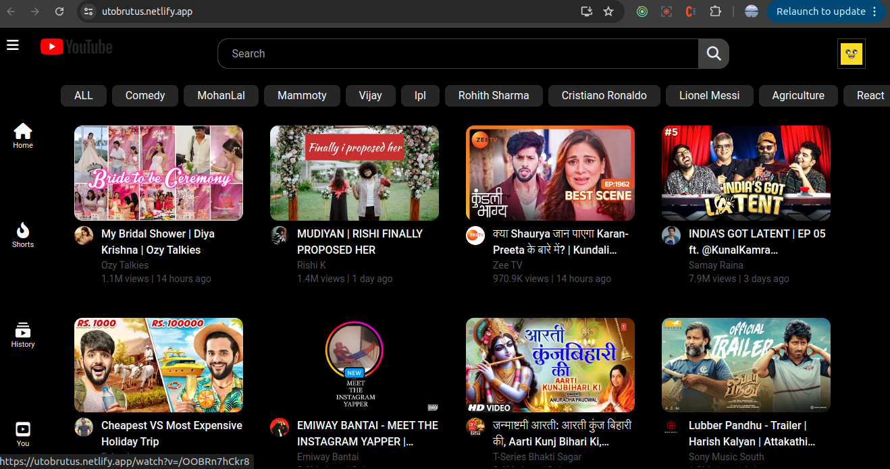
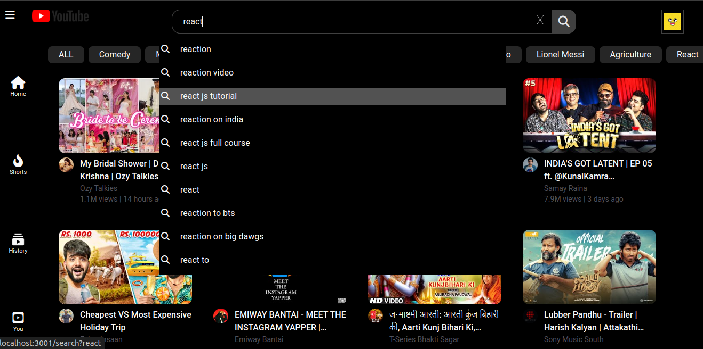
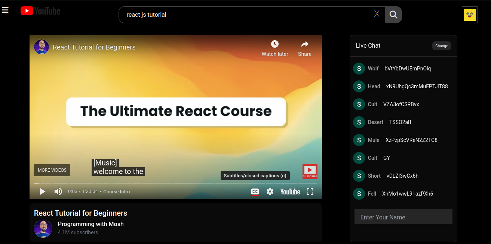
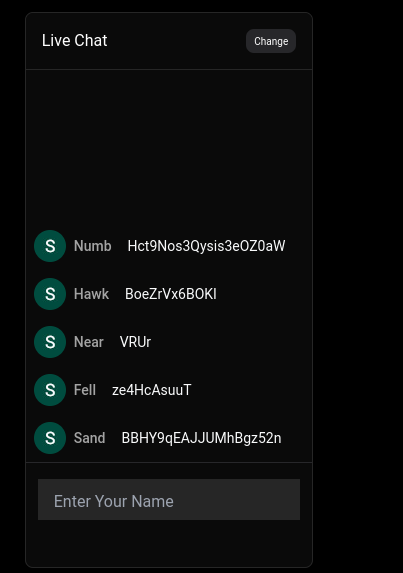
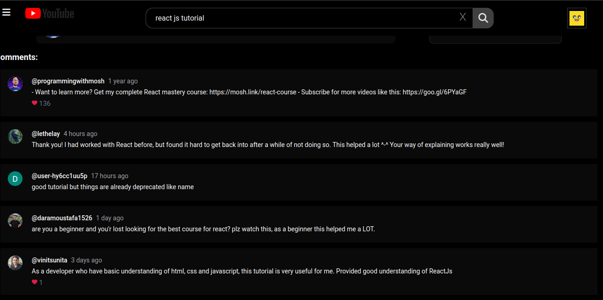

# Video Streaming App

## Overview

Developed a YouTube-like video streaming app that includes essential features such as video playback, live chat, comments, and search. The application leverages React.js with Redux for smooth state management, ensuring a seamless user experience. Reusable React components are engineered for scalability and maintainability.










## Key Features

- **Video Playback**: Seamless playback for an immersive viewing experience.
- **Live Chat**: Real-time interaction for user engagement during video playback.
- **Comments Section**: Robust section for community engagement and feedback.
- **Sidebar Navigation**: Intuitive navigation for easy access to app sections.
- **Search**: Empowering users with keyword-based video discovery.

## Technologies Used

- **React.js**: Frontend library for building user interfaces.
- **React Router**: Library for routing and navigation within the app.
- **Redux**: State management library for handling app state.
- **Tailwind CSS**: Utility-first CSS framework for styling.
- **YouTube Data API**: API for fetching video data from YouTube.

## Getting Started

### Prerequisites

- [Node.js](https://nodejs.org/) (v14 or higher)
- [npm](https://www.npmjs.com/) (Node package manager)

### Installation

1. **Clone the repository**:

   ```bash
   git clone https://github.com/username/video-streaming-app.git
